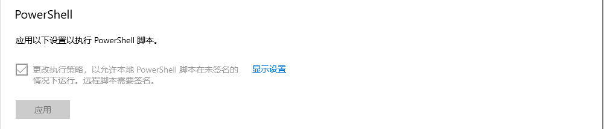

- *Author: KirkSung*
- *Date: 2024-05-25*
- *Link:* 
- *Publisher: kirksung.github.io*
- *Notes:* 
- *Tags: #Hexo #Blog*

# Hexo使用指南

hexo官方文档：[链接](https://hexo.io/zh-cn/docs/)

## Hexo的安装

Hexo的安装可以遵循官方文档中的操作过程，主要包含

1. 安装前提
	1. Git的安装
	2. Node.js的安装
2. Hexo的安装
		安装成功后，命令行中使用hexo -v检查版本，可能出现一下问题：
```
hexo : 无法加载文件 C:\Users\xxxx\AppData\Roaming\npm\hexo.ps1，因为在此系统上禁止运行脚本。有关详细信息，请参阅 https:
/go.microsoft.com/fwlink/?LinkID=135170 中的 about_Execution_Policies。
所在位置 行:1 字符: 1
+ hexo -v
+ ~~~~
    + CategoryInfo          : SecurityError: (:) []，PSSecurityException
    + FullyQualifiedErrorId : UnauthorizedAccess
```

解决方法：Windows系统，设置——开发者选项应用



## Hexo的建站

执行一下命令，Hexo将在执行文件夹中新建所需要的文件。
```
cd <folder>
hexo init
npm install
```
新建完成后，执行文件夹的目录如下。
```
.  
├── _config.yml  
├── package.json  
├── scaffolds  
├── source  
|   ├── _drafts  
|   └── _posts  
└── themes
```

## Hexo主题使用指南

### 获取主题

在个人博客中使用了[hexo-theme-fluid](https://github.com/fluid-dev/hexo-theme-fluid)，使用下载[release版本](https://github.com/fluid-dev/hexo-theme-fluid/releases)
解压到themes目录，并将解压出的文件夹重命名为fluid
### 主题配置

修改hexo博客目录中的_config.yml：

```
language: zh-CN  # 指定语言

theme: fluid  # 指定主题
```

将/themes/fluid/_config.yml 配置文件复制到根目录下，并重命名为_config.fluid.yml，后续主题的配置便可在该文件下进行配置。
具体配置可参考[Hexo Fluid用户手册](https://hexo.fluid-dev.com/docs/)

随后构建Hexo并启动Hexo内建服务器，使用浏览器访问localhost:4000即可访问Hexo博客。
```
hexo g
hexo s
```

# 部署Hexo到远程平台

## GitHub创建仓库

GitHub创建一个仓库，名称为 Github用户名.github.io，在仓库的Settings中Pages中Branch设置要显示的分支。

## 安装hexo-deployer-git

在hexo目录下，安装
```
npm install hexo-deployer-git --save
```

修改本地配置文件_config.yml中最后：
```
# Deployment
## Docs: https://hexo.io/docs/one-command-deployment
deploy:
  type: git
  repository:git@github.com:xxxx/xxxx.github.io.git
  branch: master
```

注意：在本地使用了master分支，github个人仓库中默认使用main分支。

使用hexo d进行部署。

附录：
1. Hexo文章中插入本地图片

修改根目录下_config.yml文件中的post_asset_folder的值将false改为true，在使用
```
hexo new "title"
```
的时候同时创建一个对应的文件夹用于存储需要导入的图片。

安装hexo-render-marked插件
```
npm install https://github.com/CodeFalling/hexo-asset-image --save
```

使用markdown标签进行引用
! [图片描述] (folder/xxx.png)


# 参考

1. [Hexo+obsidian+github完美建站教程](https://zhuanlan.zhihu.com/p/613429644?utm_campaign=shareopn&utm_medium=social&utm_psn=1775230951238590464&utm_source=wechat_session) CR：狸豹一家亲
2. [Hexo快速搭建指南](https://blog.esunr.site/2022/06/64163235c30f.html#1-%E5%AE%89%E8%A3%85%E4%B8%8E%E4%BD%BF%E7%94%A8-Hexo) CR：EsunR-Blog


